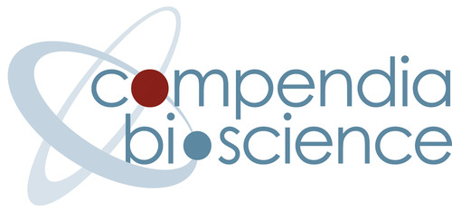

# Hello World <!-- .element style="font-family: monospace; color: limegreen" -->
Note: The purpose of this presentation is to provide you with a bit of context for where I am
coming from, how I communicate, and what my management philosophy is.

## Living the Dream
<!-- .slide: data-background="images/self.png" -->
Note: I recently went through onboarding. For the first week every onboarding class started with an
icebreaker question, e.g. "What is your favorite animal?", "Where are you from?", "What is one thing
almost nobody knows about you?" One of these question was "What did you want to be when you were a
little kid?" There were a lot of unsurprising answers like doctor and lawyer, there were a few funny
answers like T-Rex, but of all the folks in that onboarding class I think I was the only one who got
to answer with my current job - Software Developer. This was a really clarifying moment for me. Not
only do I feel incredibly fortunate to have my childhood dream job, but, I feel doubly fortunate
that I truly still love it. After nearly 12 years in the industry I love software. I love working on
hard problems. I love learning something new every day. I love helping others grow in their career
and in their love for what they do every day. So what I came to realize is that I am living the
dream and it is my sincere hope that you are too. Maybe it was not your first dream. Maybe you also
wanted to be a T-Rex when you grew up but I hope that is is your dream now.

## Career
|                                             |                                                     |
| ------------------------------------------- | --------------------------------------------------- | 
|  |  |
|                |                   |
|                 |                           |

<!-- .element id="career-table" -->
Note:  This is where I am coming from.

## Other Interesting Jobs

* Graduation Photographer
* Line Company Operator
* High School Teacher

# Communication
|           |             |
| --------- | ----------- |
| &#x1F610; | Happy       | 
| &#x1F610; | Sad         | 
| &#x1F610; | Overwhelmed | 
| &#x1F610; | Bored       | 
| &#x1F610; | Excited     | 
| &#x1F610; | Inquisitive | 
Note: I am not a terrible emotive communicator and I have been told that I can be hard to read. I
am, a fairly good verbal communicator. If you are ever having trouble reading me or you are unclear
just ask and I can clarify.

## Things I am Good At
* Code quality
* Team process
* Mentorship
* Long term developer productivity

## Things I am not Good at (Yet)
* The team
* Company + team history
* The current process

## Things I Have Not Done Recently/Ever

* Work on a client facing team
* Work + Dad at the same time

# Management Philosophy
<!-- .slide: data-background="images/watercolour-1325656_1920.jpg" -->
Note: Image by <a href="https://pixabay.com/users/stux-12364/?utm_source=link-attribution&amp;utm_medium=referral&amp;utm_campaign=image&amp;utm_content=1325656">Thanks for your Like • donations welcome</a> from <a href="https://pixabay.com/?utm_source=link-attribution&amp;utm_medium=referral&amp;utm_campaign=image&amp;utm_content=1325656">Pixabay</a>

## Role of a Manager
* Context down
* Details up
* Career support
* Prioritization
* Process

## Principals
* We are one team
* You are not typists
* You are all adults
* Time is the most valuable asset
* I am not the smartest person here
* I will trade short term loss for long term gain
Note: We are one team we support each other, we have a shared vision of success and we help each
other grow. 
You are not a typist. You compensation is not based on the number of hours you spend at
the keyboard. Software development is a creative role. That being said I still expect roughly 40 hrs
a week of productive work for Plaid.
You are all adults. I will not monitor the number of lines you produce. I will not stand over your
shoulder and watch what you do. I expect you to take your job seriously respect your team and be
honest. This also means you don't need to ask permission to go to the doctor but I still need
notice.
Time is the most valuable asset. For software companies this is usually literally true. There is no
greater expense that our time and we should all take that to heart. Meetings should have a clear
objective and topics should be relevant to everyone attending. If the discussion veers into
something only a subset of folks care about it should be noted for a discussion later on or the
other participants should be excused if there are no agenda items left.
I am not the smartest person here. It is not my job to be the smartest or know the most. In many
ways I know the least about the team, the process, the code and, the challenges you face.
I will trade short term loss for long term gain. I believe one of the most common failures of teams
and companies is a sense of permanent short-termism. I make an effort to recognize this and make
trade-offs when appropriate. Sometimes these trade-offs involve some short term pain.

## Agile
> Individuals and interactions over processes and tools

> Working software over comprehensive documentation

> Customer collaboration over contract negotiation

> Responding to change over following a plan

<!-- .element style="width: unset" -->
[agilemanifesto.org](agilemanifesto.org)
Note: I am coming from a long history of Agile shops. If you are not familiar with it here is the
agile manifesto. If you have not read it before it is incredibly short. In addition to the manifesto
the creators of agile also identified twelve principals of agile software development. I encourage
you to take a look at them but I am going to focus on just one today.

## Retrospective
<!-- .slide: data-background="images/rear-view-mirror-835085_1920.jpg" -->
> At regular intervals the team reflects on how to become more effective, then tunes and adjusts its
> behavior accordingly
Note: This Agile principal is the motivating force behind the retrospective used in the SCRUM
process. One of the most powerful outcomes of following this principal is that it enables low cost
experimentation for the team. We get to try out new ideas, commit to them for an iteration and then
retrospect on the experiment. Did it work? Are there things we want to change? Should we do
something different or abandon this idea all together. Retrospectives are a powerful tool in
enabling experimentation and continuously improving not just the software but also the process by
which we create the software.

## Experimentation
<!-- .slide: data-background="images/light-bulb-4409109_1920.jpg" -->
Note: In the coming days I am going to introduce a few process experiments. Before that happens I
want to put a few guidelines around what a process experiment is and how we conduct one.
Image by <a href="https://pixabay.com/users/Alexas_Fotos-686414/?utm_source=link-attribution&amp;utm_medium=referral&amp;utm_campaign=image&amp;utm_content=4409109">Alexas_Fotos</a> from <a href="https://pixabay.com/?utm_source=link-attribution&amp;utm_medium=referral&amp;utm_campaign=image&amp;utm_content=4409109">Pixabay</a>

# Ownership
<!-- .slide: data-background="images/atlas-1164424_1920.jpg" -->
Note: Image by <a href="https://pixabay.com/users/ddouk-607002/?utm_source=link-attribution&amp;utm_medium=referral&amp;utm_campaign=image&amp;utm_content=1164424">Denis Doukhan</a> from <a href="https://pixabay.com/?utm_source=link-attribution&amp;utm_medium=referral&amp;utm_campaign=image&amp;utm_content=1164424">Pixabay</a>

## Individual Ownership
* Rapid assignment
* Rapid response

* Information silos
* Inconsistent code
* Poor work life balance
* Hard to focus on new projects
* Weak unit cohesion

## Team Ownership
* Mentorship
* Work life balance
* Improved code quality
* Improved code consistency
* Easier to focus on new projects

 
* Slower response

## Recommended Reading (and listening)
<!-- .slide: class="contrast-bg" data-background="images/books-1655783_1280.jpg" -->
* [This American Life #561 - NUMMI 2015](https://www.thisamericanlife.org/561/nummi-2015)
* Clean Code - Robert C. Martin
* Working Effectively With Legacy Code - Michael C. Feathers
* To Sell Is Human - Daniel H. Pink
* How Google Tests Software - James A. Whittaker et al.

# ?
<!-- .slide: data-background="images/sunset-1373171_1920.jpg" -->
Note: Image by <a href="https://pixabay.com/users/Cleverpix-2508959/?utm_source=link-attribution&amp;utm_medium=referral&amp;utm_campaign=image&amp;utm_content=1373171">Cindy Lever</a> from <a href="https://pixabay.com/?utm_source=link-attribution&amp;utm_medium=referral&amp;utm_campaign=image&amp;utm_content=1373171">Pixabay</a>
