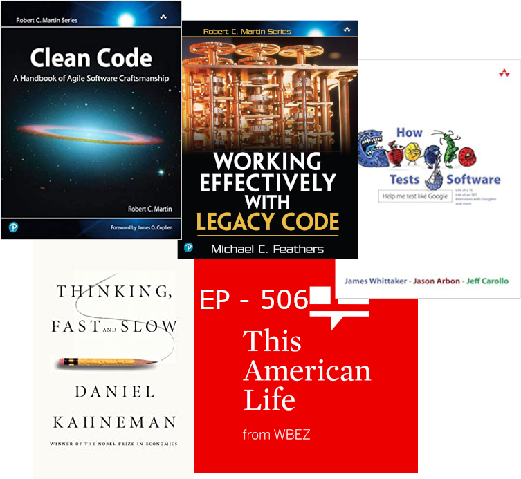

# Hello World <!-- .element style="font-family: monospace; color: limegreen" -->
Note: The purpose of this presentation is to provide you with a bit of context for where I am
coming from, how I communicate, and what my management philosophy is.

## Living the Dream
<!-- .slide: data-background="images/self.png" -->
Note: I recently went through onboarding. For the first week every onboarding class started with an
icebreaker question, e.g. "What is your favorite animal?", "Where are you from?", "What is one thing
almost nobody knows about you?" One of these question was "What did you want to be when you were a
little kid?" There were a lot of unsurprising answers like doctor and lawyer, there were a few funny
answers like T-Rex, but of all the folks in that onboarding class I think I was the only one who got
to answer with my current job - Software Developer. This was a really clarifying moment for me. Not
only do I feel incredibly fortunate to have my childhood dream job, but, I feel doubly fortunate
that I truly still love it. After nearly 12 years in the industry I love software. I love working on
hard problems. I love learning something new every day. I love helping others grow in their career
and in their love for what they do every day. So what I came to realize is that I am living the
dream and it is my sincere hope that you are too. Maybe it was not your first dream. Maybe you also
wanted to be a T-Rex when you grew up but I hope that is is your dream now.

## Career
|                                             |                                                     |
| ------------------------------------------- | --------------------------------------------------- | 
|  |  |
|                |                   |
|                 |                           |

<!-- .element id="career-table" -->

## Other Interesting Jobs
* Graduation Photographer
* Line Company Operator - USMC
* High School CS Teacher

# Communication
|           |             |
| --------- | ----------- |
| &#x1F610; | Happy       | 
| &#x1F610; | Sad         | 
| &#x1F610; | Overwhelmed | 
| &#x1F610; | Bored       | 
| &#x1F610; | Excited     | 
| &#x1F610; | Inquisitive | 

Note: I am not a terrible emotive communicator and I have been told that I can be hard to read. I
am, a fairly good verbal communicator. If you are ever having trouble reading me or you are unclear
just ask and I can clarify.

## Things I am Good At
* Code quality
* Team process
* Mentorship
* Career advocacy

## Things I am not Good at (Yet)
* Praise
* Social stuff - Especially now
* A "How can I help you" approach

Note: I'm bad at praise because things that are working are boring to me so I tend to focus in on
what can be improved. I don't know if this is coming from being in the military, or from my
perspective as an engineer or a part of my very nature. Whatever the source it is very hard to
break.
For the social aspect - I have two very small children so anything in person feels very risky.
Virtual events after hours are a challenge as well. Toddlers have a whole routine to follow and it's
a lot of work to keep them on track.

# Management Philosophy
<!-- .slide: data-background="images/watercolour-1325656_1920.jpg" -->
Note: Image by <a href="https://pixabay.com/users/stux-12364/?utm_source=link-attribution&amp;utm_medium=referral&amp;utm_campaign=image&amp;utm_content=1325656">Thanks for your Like • donations welcome</a> from <a href="https://pixabay.com/?utm_source=link-attribution&amp;utm_medium=referral&amp;utm_campaign=image&amp;utm_content=1325656">Pixabay</a>

## Role of a Manager
* Career support
* Praise & Feedback
* Prioritization
* Process
* Context down
* Details up

## Principals
* We are one team
* You are not typists
* You are all adults
* Time is the most valuable asset
* I am not the smartest person here
* I will trade short term loss for long term gain

Note: We are one team we support each other, we have a shared vision of success and we help each
other grow. 
You are not a typist. You compensation is not based on the number of hours you spend at
the keyboard. Software development is a creative role. That being said I still expect roughly 40 hrs
a week of productive work for Plaid.
You are all adults. I will not monitor the number of lines you produce. I will not stand over your
shoulder and watch what you do. I expect you to take your job seriously respect your team and be
honest. This also means you don't need to ask permission to go to the doctor but I still need
notice.
Time is the most valuable asset. For software companies this is usually literally true. There is no
greater expense that our time and we should all take that to heart. Meetings should have a clear
objective and topics should be relevant to everyone attending. If the discussion veers into
something only a subset of folks care about it should be noted for a discussion later on or the
other participants should be excused if there are no agenda items left.
I am not the smartest person here. It is not my job to be the smartest or know the most. In many
ways I know the least about the team, the process, the code and, the challenges you face.
I will trade short term loss for long term gain. I believe one of the most common failures of teams
and companies is a sense of permanent short-termism. I make an effort to recognize this and make
trade-offs when appropriate. Sometimes these trade-offs involve some short term pain.

## Expectations I have of you
* You are the first owner of your career
* You are accountable to your commitments
* Escalate when you get stuck
* You are the expert
* Act as a professional
* Operate as a team

Note:
* You own your career. If you are not getting what you want out of your time here at Plaid you
need to make clear what you need, more time from me, different mentorship, different projects.
* You are accountable to your commitments. That does not mean you will always make them, but, you
  will be clear when you cannot.
* If you get stuck or not feeling productive, I expect you to escalate. This goes along with the
  principal that you are all adults. I will not go out of my way to check in on you or your
progress.
* You are the expert. You have spent more time in the code. It is likely that you have been here
  longer. You know the systems better. Suggestions I make and questions I ask should be treated as
just that. They are intended to help guide you to a better solution but ultimately you have the most
context.
* Act as a professional. Treat your coworkers and me with respect. Come to work every day. Not
  everything will be fun.
* Operate as a team. We will support each others growth and success.

## Expectations you should have of me
* I will support your career growth
* I am accountable to my commitments
* I will ask challenging questions
* I am here to support you

# Team Philosophy
<!-- .slide: data-background="images/watercolour-1325656_1920.jpg" -->
### One Team One Dream <!-- .element: class="fragment" -->

# Ownership
<!-- .slide: data-background="images/atlas-1164424_1920.jpg" -->
Note: Image by <a href="https://pixabay.com/users/ddouk-607002/?utm_source=link-attribution&amp;utm_medium=referral&amp;utm_campaign=image&amp;utm_content=1164424">Denis Doukhan</a> from <a href="https://pixabay.com/?utm_source=link-attribution&amp;utm_medium=referral&amp;utm_campaign=image&amp;utm_content=1164424">Pixabay</a>

## Individual Ownership
* Deep expertise
* Faster short term execution

* Information silos
* Inconsistent code
* Poor work life balance
* Weak unit cohesion
* Useless group estimation

## Team Ownership
* Natural opportunities for mentorship
* Better work life balance - Easier to step back
* Improved code consistency
* Valuable group estimation
* Good unit cohesion #oneteam
* Faster long term execution velocity

* Slower short term execution velocity
* Longer to build expertise

## Agile
> <ins>**Individuals and interactions**</ins> over processes and tools 
> <ins>**Working software**</ins> over comprehensive documentation 
> <ins>**Customer collaboration**</ins> over contract negotiation 
> <ins>**Responding to change**</ins> over following a plan 

<!-- .element style="width: unset" -->
[agilemanifesto.org](agilemanifesto.org)

Note: I am coming from a long history of Agile shops. If you are not familiar with it here is the
agile manifesto. If you have not read it before it is incredibly short. In addition to the manifesto
the creators of agile also identified twelve principals of agile software development. I encourage
you to take a look at them but I am going to focus on just one today.

# Read a book
<!-- .slide: data-background="images/books-g3a12777da_1920.jpg" -->

## On Engineering

<!-- .element: style="width: 60%; background: none" -->

## On Life

<!-- .element: style="width: 60%; background: none" -->

# ?
<!-- .slide: data-background="images/sunset-1373171_1920.jpg" -->
Note: Image by <a href="https://pixabay.com/users/Cleverpix-2508959/?utm_source=link-attribution&amp;utm_medium=referral&amp;utm_campaign=image&amp;utm_content=1373171">Cindy Lever</a> from <a href="https://pixabay.com/?utm_source=link-attribution&amp;utm_medium=referral&amp;utm_campaign=image&amp;utm_content=1373171">Pixabay</a>
