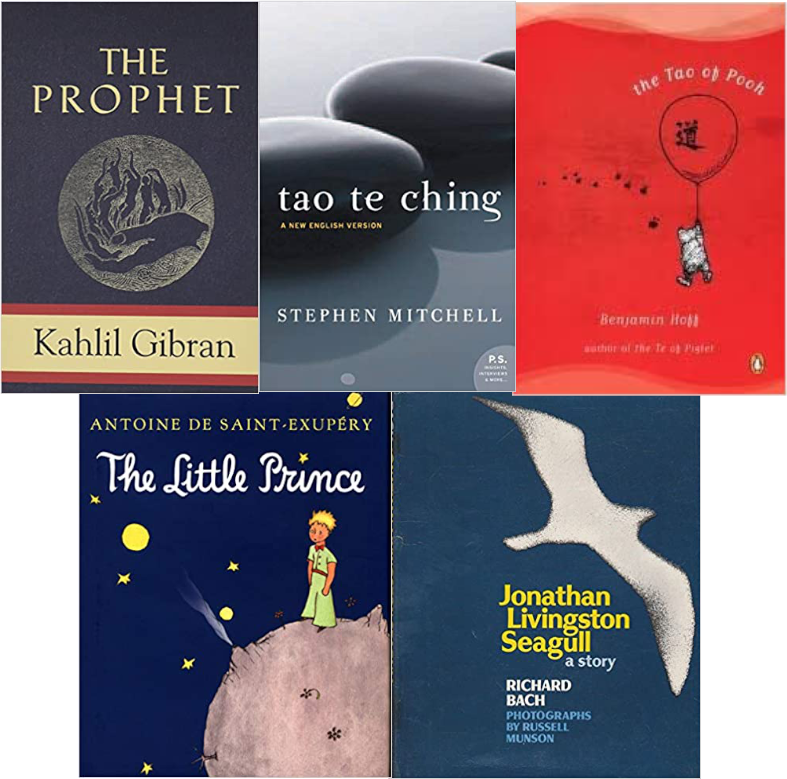

# README <!-- .element style="font-family: monospace; color: limegreen" -->
Note: The purpose of this presentation is to provide you with a bit of context for where I am
coming from, how I communicate, and what my management philosophy is.

## Career

<!-- .element: style="width: 65%; margin: auto; background: white" -->

## Other Interesting Jobs
* Graduation Photographer
* Line Company Operator - USMC
* High School CS Teacher

## Living the Dream
<!-- .slide: data-background="images/self.png" -->
Note: Once, as part of an onboarding process, the onboarding class was asked the
following ice icebreaker question "What did you want to be when you were a little kid?"
There were a lot of unsurprising answers like doctor and lawyer, there were a few funny
answers like T-Rex, but of all the folks in that onboarding class I was the only who
answered with Software Developer. This was a clarifying moment for me. Very few people
get to do their dream job. Dream change, challenges abound, but I am happy to say that
this is it for me. This is has been the dream for as long as I can remember and it still
is.
I love learning something new every day. I love helping others grow in their career and
in their love for what they do every day. So what I came to realize is that I am living
the dream and it is my sincere hope that you are too. Maybe it was not your first dream.
Maybe you also wanted to be a T-Rex when you grew up but I hope that is is your dream
now.

# Communication
|           |             |
| --------- | ----------- |
| &#x1F610; | Happy       | 
| &#x1F610; | Sad         | 
| &#x1F610; | Overwhelmed | 
| &#x1F610; | Bored       | 
| &#x1F610; | Excited     | 
| &#x1F610; | Inquisitive | 

Note: I am not a terrible emotive communicator and I have been told that I can be hard to read. I
am, a fairly good verbal communicator. If you are ever having trouble reading me or you are unclear
just ask and I can clarify.

## Things I am Good At
* Code quality
* Team process
* Mentorship

# Management Philosophy
<!-- .slide: data-background="images/watercolour-1325656_1920.jpg" -->
Note: Image by <a href="https://pixabay.com/users/stux-12364/?utm_source=link-attribution&amp;utm_medium=referral&amp;utm_campaign=image&amp;utm_content=1325656">Thanks for your Like • donations welcome</a> from <a href="https://pixabay.com/?utm_source=link-attribution&amp;utm_medium=referral&amp;utm_campaign=image&amp;utm_content=1325656">Pixabay</a>

## Role
* Mentorship 
* Prioritization
* Process
* Culture
* Context down
* Details up

## Principals
* We are one team
* You are all adults
* Long term investments pay off
* Time is the most valuable asset
* Software Engineering is a creative endeavor
Note: We are one team we support each other, we have a shared vision of success and we help each
other grow. 
You are not a typist. You compensation is not based on the number of hours you spend at
the keyboard. Software development is a creative role. That being said I still expect roughly 40 hrs
a week of productive work for Plaid.
You are all adults. I will not monitor the number of lines you produce. I will not stand over your
shoulder and watch what you do. I expect you to take your job seriously respect your team and be
honest. This also means you don't need to ask permission to go to the doctor but I still need
notice.
Time is the most valuable asset. For software companies this is usually literally true. There is no
greater expense that our time and we should all take that to heart. Meetings should have a clear
objective and topics should be relevant to everyone attending. If the discussion veers into
something only a subset of folks care about it should be noted for a discussion later on or the
other participants should be excused if there are no agenda items left.
I am not the smartest person here. It is not my job to be the smartest or know the most. In many
ways I know the least about the team, the process, the code and, the challenges you face.
I will trade short term loss for long term gain. I believe one of the most common failures of teams
and companies is a sense of permanent short-termism. I make an effort to recognize this and make
trade-offs when appropriate. Sometimes these trade-offs involve some short term pain.

## Expectations you should have of me
* Mentorship
* Support
* Communication
* Accountability
Note: One of my goals is to invest in you. I am here to help you grow and help you live
the dream. Beyond career support I am also here to help the mission succeed. Through
technical contribution, design, pairing up, testing, debugging, meeting with customers,
working across funnctions, whatever the mission calls for I am here to help it succeed.
I will communicate honestly with you and often with humility. I am new here and there is
a lot I do not know.
Last you you should expect me to be accountable to my commitments. I will do what I say
to the best of my ability and if I cannot I will let you know.

## Expectations I have of you
* Own your career
* Operate as a team
* Professionalisim
* Communication
* Accountability
Note:
* You own your career. If you are not getting what you want out of your time here at Plaid you
need to make clear what you need, more time from me, different mentorship, different projects.
* You are accountable to your commitments. That does not mean you will always make them, but, you
  will be clear when you cannot.
* If you get stuck or not feeling productive, I expect you to escalate. This goes along with the
  principal that you are all adults. I will not go out of my way to check in on you or your
progress.
* You are the expert. You have spent more time in the code. It is likely that you have been here
  longer. You know the systems better. Suggestions I make and questions I ask should be treated as
just that. They are intended to help guide you to a better solution but ultimately you have the most
context.
* Act as a professional. Treat your coworkers and me with respect. Come to work every day. Not
  everything will be fun.
* Operate as a team. We will support each others growth and success.

# Read a book
<!-- .slide: data-background="images/books-g3a12777da_1920.jpg" -->

## On Engineering

<!-- .element: style="width: 65%; margin: auto" -->

[A Typology of Organisational Culture](https://www.ncbi.nlm.nih.gov/pmc/articles/PMC1765804/pdf/v013p0ii22.pdf)<!-- .element style="font-size: small; margin: none" -->
&#x2022;
[TAL - 561 - NUMMI](https://www.thisamericanlife.org/561/nummi-2015)<!-- .element style="font-size: small; margin: none" -->

## On Life

<!-- .element: style="width: 65%; margin: auto" -->

# ?
<!-- .slide: data-background="images/sunset-1373171_1920.jpg" -->
Note: Image by <a href="https://pixabay.com/users/Cleverpix-2508959/?utm_source=link-attribution&amp;utm_medium=referral&amp;utm_campaign=image&amp;utm_content=1373171">Cindy Lever</a> from <a href="https://pixabay.com/?utm_source=link-attribution&amp;utm_medium=referral&amp;utm_campaign=image&amp;utm_content=1373171">Pixabay</a>
