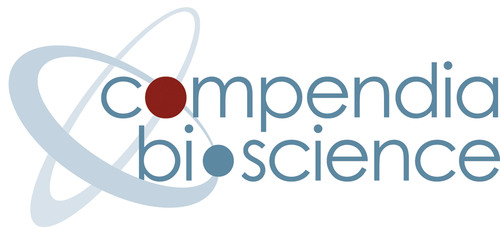

#  Engineering Productivity
<!-- .slide: data-background="images/light-bulb-1246043_1920.jpg" -->

## First a Little Context
<!-- .slide: data-background="images/self.png" -->

Note: I have been programming for quite a while. Now I really didn't start this early, but it was
pretty close. I actually started learning BASIC on an Apple IIe when I was 12 and I pretty much kept
going since then. So programming really has become my lifelong passion.

## An Agile Introduction

& <!-- .element style="font-size: 60px" -->

 <!-- .element style="width: 28%" -->

Note: I've been in the industry for over ten years but I started at a little company called Menlo
Innovations followed by Compendia Bioscience. Both of these companies use Agile and extreme
programming, with pair programming, weekly sprints, demos to a realistic customer and, literal TDD.
I had an enormous amount of fun at these two companies and the it was formative for a few reasons
but critically as a contrast to my next company.

## An SDET is Born
 <!-- .element style="background: none" -->

Note: From these two companies I moved to Microsoft where I was initially hired as an SDET or
Software Developer Engineer in Test. A job  I completely did not understand. This is a job that
Microsoft has mostly done away with but one of my responsibilities was to figure out which bugs to
fix and which bug we were not going to fix. This seemed like a ridiculous way to do business.
Microsoft paid a developer 80K to write the bugs, they paid me 80K to sort the bugs we fix and then
we dumped the rest of the known bugs onto the customer along with the whatever we did not find.

## A Radioactive Spider Bite 
* Microsoft
* Bloomberg L.P.
* WeWork

Note: I started learning about programming when I was I was  been in the industry for over 10 years across a variety
of companies.
## 
