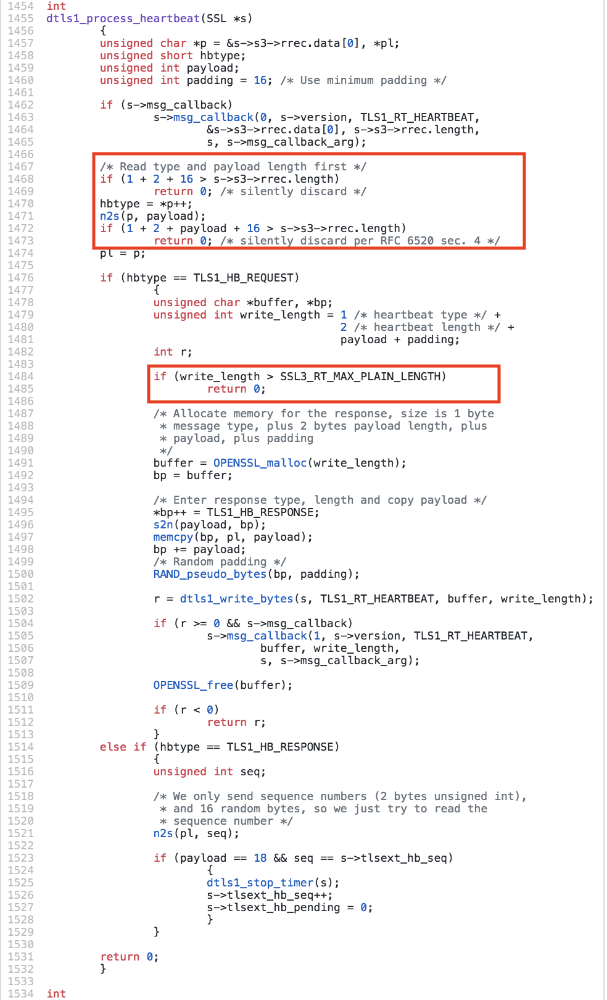
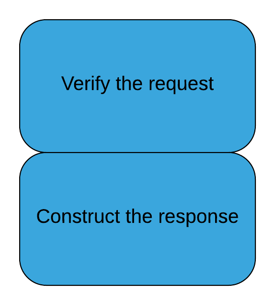
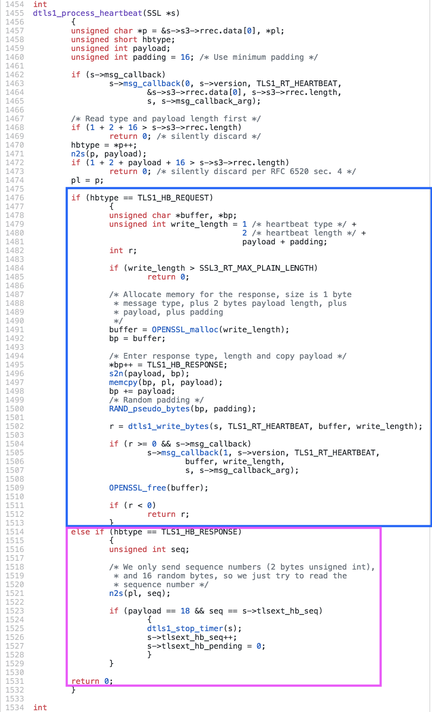

# Writing The Right Test

<!-- .slide: data-background="images/leaf-1571833_1920.jpg" -->


<!-- .slide: data-background="images/questions-2245264_1920.jpg" -->


<!-- .slide: data-background="images/why-2028047_1280.png" -->


## Correctness 

```c
    if ((err = ReadyHash(&SSLHashSHA1, &hashCtx)) != 0)
        goto fail;
    if ((err = SSLHashSHA1.update(&hashCtx, &clientRandom)) != 0)
        goto fail;
    if ((err = SSLHashSHA1.update(&hashCtx, &serverRandom)) != 0)
        goto fail;
    if ((err = SSLHashSHA1.update(&hashCtx, &signedParams)) != 0)
        goto fail;
        goto fail;
    if ((err = SSLHashSHA1.final(&hashCtx, &hashOut)) != 0)
        goto fail;
```
<!-- .element style="width: 100%" -->


## `goto fail;`

> [The goto fail bug] does not check the signature in a TLS Server Key Exchange message, which allows man-in-the-middle attackers to spoof SSL servers by (1) using an arbitrary private key for the signing step or (2) omitting the signing step

[CVE-2014-1266](https://nvd.nist.gov/vuln/detail/CVE-2014-1266)


## Test 

>Unit testing introduces pressure to minimize copy/paste, because the copy/pasted code also has to be unit tested. It could have ensured that only one copy of this algorithm existed since it would have been easier to test. A unit test could have easily verified that this algorithm was correct, merge or no, and could have prevented the &quot;goto fail&quot; bug from being written in the first place.

<!-- .element style="width: 100%" -->

[Testing Culture - Mike Bland](https://martinfowler.com/articles/testing-culture.html)


## Consider This Specification 

```c++
/* This method receives a payload from a sender and echos it back 
** The payload is sent as part of the char* msg which has the
** following format:
** The message type [1 byte]
** The payload size [2 bytes]
** The payload data [ <= 16365 bytes ]
** The message type can either be request (0) or response (1)
** other values will result in the request being silently ignored 
** The payload size cannot exceed 16365 or the request is ignored
** The payload cannot exceed 16365 bytes or the request ignored
** On a successful message the payload is sent back to the sender
**   
*/
void processMessage(Sender* sender, char* msg, int msgSize)
```
<!-- .element style="width: 100%" -->


## Positive Tests (a.k.a The Happy Path)

* Send a request message with "Hello World" expect back "Hello World"
* Send a request with the max size payload expect back the same payload


## Negative Tests (a.k.a The Good Stuff)

* Send a request with 0 payload. Expect back "".
* Send a request with an invalid type. Expect no response.
* Send a request with a payload that is too large. Expect no response.
* Send a request with a payload size smaller than the payload. Expect ?<!-- .element: class="fragment" -->
* Send a request with a payload size larger than than the payload. Expect ?<!-- .element: class="fragment" -->


## Heartbleed


Note: These last few tests cover would have protect the heart bleed bug. Specifically sending a request with the payload size larger then the actual payload. This resulted in the server copying arbitrary data from memory and sending it back to the requester. Comparing the user supplied payload size against the total size of the packed message the server would have been trivial and would have prevented the heart bleed bug.


# Design

<!-- .slide: data-background="images/pencils-452238_1920.jpg" -->


## Verification Logic


<!-- .element  style="max-width: 45%" -->

Note: The verification logic is in a few places. But we should be able to split it out safely. 


## Let's Look at the Heartbeat code again

<!-- .element  style="max-width: 45%" -->

Note: This function has two core responsibilities it has to verify that the contents of the message meet certain criteria and it has to construct the response. The heart bleed bug occurred in the "Verification" section of the code so we would like to split that out from the rest of the code so we can rigorously test it.


## Heartbeat Request 

```c++
class HBRequest {
	public:
	HBReqest(char * msg, int msgSize);
	HBRequestType getType();
	char const * getPayload();
	int getPayloadSize();
};
```

Note: The function talks a lot about the idea of a *request* it has a payload a size and a type so I would like to introduce a new class to represent this idea. I'll call it `HBReqest`. The constructor will take the packed data and the data size and execute all of the verification logic. If any of the verification fails then the constructor can throw an exception. This should let us isolate the verification logic and move through the rest of the logic confident that the heartbeat request is valid.


## New Layout

```c++
try {
  HBrequest request(msg, msgSize);
  // ... construct response
} catch (InvalidRequest) {
  return 0;
}
```


## Strategies


<!-- .element  style="max-width: 45%" -->

Note: We could take this refactoring even further if we wanted. This method has two different and mostly unrelated sets of behavior using something like a strategy pattern.


## New Layout

```c++
try {
  HBRequest request(msg, msgSize);
  ResponseStrategy* strategy = makeStrategy(request.getType());
  strategy.handleHBRequest(...);
} catch (InvalidRequest) {
  return 0;
}
```


## Simplify

"... there should be a continuous effort to simplify (refactor) the code, because otherwise just adding capabilities will slowly increase the software complexity. The code should be refactored over time to make it simple and clear, not just constantly add new features" - David Wheeler


# Automated tests transform fear into boredom

-Eran Messeri

Note: As long as we can maintain the contract the function we can do whatever we want to the implementation.


# Documentation

<!-- .slide: data-background="images/alphabets-2518268_1920.jpg" -->


## High quality tests act as documentation for our software

<pre>
An API class
  when the server is up
<div style="color: green">
    can GET a url
    can POST a url
    can PUT a url
    can DELETE a url
    uses query parameters
    turns the request body to json
    uses the request headers
</div>
    and authentication is set
<div style="color: green">
      adds authentication to the headers
      ...
</div>
</pre>


<div class="rocket animate">
<h1 class="outline-text">Why</h1>
<!-- .slide: data-background="images/rocket-969_1920.jpg" -->
<pre class="outline-text" style="box-shadow: none; text-align: center;">
Verification + Design + Documentation
=
Velocity
</pre>
</div>
